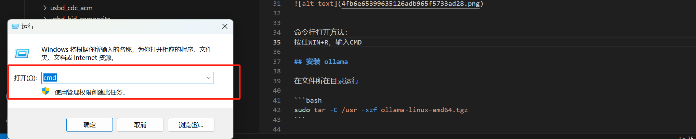

# DeepSeek 本地部署教程

## 说明

* 包含deepseek以及配套的webui安装，可以多台终端访问。
部署教程针对我们自己现有的环境,系统是ubuntu,没有windows与mac部分。

* 尝试过多种方法部署，发现还是使用ollama最简单，对于熟悉Linux以及经常翻墙的同学来说安装很简单。

* 确保自己的机器有足够性能的显卡，我们使用的是NVIDIA GeForce GTX 1080


## 下载 ollama

地址：https://ollama.com/download/linux


对于翻墙了的同学可以直接使用官方的安装脚本：

```bash
curl -fsSL https://ollama.com/install.sh | sh
```

没有翻墙的同学可以从网盘直接下载安装包：

链接: https://pan.baidu.com/s/14_DjljSrYJkCRGxNqJ4qRw?pwd=6s8e 提取码: 6s8e 复制这段内容后打开百度网盘手机App，操作更方便哦

也可以用国内镜像下载：


安装包有1.6G，请耐心等待。


## 安装 ollama

在文件所在目录运行

```bash
sudo tar -C /usr -xzf ollama-linux-amd64.tgz
```

文件较大，耐心等待。


## 运行ollma
```bash
ollama serve
```

运行成功后可以看到类似的信息




## 下载DEEPSEEK模型

运行成功后不要关闭ollama程序，打开一个新的终端，或者让ollama在后台运行。


```bash
ollama run deepseek-r1:8b
```

上述指令是运行DEEPSEEK-R1 8B模型，请根据自己的硬件性能选择
可以使用的DEEPSEEK模型有：


* ollama run deepseek-r1:1.5b

* ollama run deepseek-r1:8b

* ollama run deepseek-r1:32b

* ollama run deepseek-r1:70b

* ollama run deepseek-r1:671b


模型较大，耐心等待下载。

## 开始本地对话

到这一步部署其实已经完成了，可以在命令行中进行本地对话。


## 安装 open web ui

后续补充


## 将ollama设置成后台运行


## AI应用交流群

AI时代，我们一起探讨实际落地的应用，微信群：


二维码过期可以添加好友拉群：


